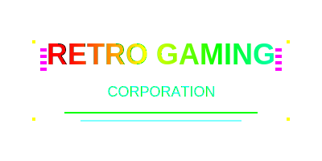

# 🎮 Retro Arcade Adventure

A nostalgic 80s-style arcade game built with Phaser.js, featuring authentic retro gameplay mechanics, visual effects, and sound design that captures the essence of classic arcade gaming from the 1980s.



## 🚀 Running the Game

### Option 1: Direct File Access
1. Clone or download the project
2. Open `retro-arcade-game/index.html` in your web browser
3. Start playing!

### Option 2: Local Server (Recommended)
1. Navigate to the `retro-arcade-game` directory
2. Start a local HTTP server:
   ```bash
   python -m http.server 8000
   ```
3. Open your browser and go to `http://localhost:8000`
4. Enjoy the game!

## ✨ Features

### 🏆 **Authentic 80s Arcade Experience**
- **Insert Coin Screen**: Classic arcade-style attract mode with credit counter
- **High Score System**: Persistent high scores with name entry and retro styling
- **Company Logo Sequence**: "EST. 1982" presentation with color cycling
- **Loading Screen**: System boot simulation with progress bars and status messages

### 🎵 **Enhanced Audio System**
- **Web Audio API Synthesis**: Authentic retro sound generation
- **Classic Arcade Sounds**: Coin insert, blips, selections, and game sounds
- **80s Synth Effects**: Square, sawtooth, and triangle wave oscillators
- **Dynamic Soundtrack**: Context-aware audio that responds to game events

### 💥 **Retro Visual Effects**
- **Screen Shake**: Camera shake effects for impacts and dramatic moments
- **Flash Effects**: Color flashes for power-ups, damage, and achievements
- **Particle Systems**: Burst effects for collectibles and game events
- **Glitch Effects**: Retro-style visual distortions
- **Electric Discharges**: 80s-style electric effects

### 🎯 **Core Gameplay**
- **Player Controls**: Arrow keys for movement, spacebar for actions
- **Enemy AI**: Multiple enemy types (random, chaser, patrol) with increasing difficulty
- **Collectible System**: Gather items to increase score and advance rounds
- **Health System**: Take damage from enemies, game over when health reaches zero
- **Progressive Difficulty**: Enemy speed increases with each round

### 🕹️ **80s Arcade Aesthetics**
- **Pixel-Perfect Graphics**: SVG-based sprites with retro styling
- **CRT Effects**: Simulated CRT monitor effects in CSS
- **Retro Fonts**: Press Start 2P font for authentic 80s look
- **Color Schemes**: Classic 80s color palettes
- **Smooth Transitions**: 80s-style screen transitions and effects

## 🎮 How to Play

1. **Start the Game**: Open `index.html` in a web browser
2. **Insert Coin**: Click or press spacebar at the "Insert Coin" screen
3. **Navigate Menus**: Use mouse clicks or keyboard to navigate
4. **Play the Game**:
   - Use arrow keys to move your character
   - Collect items to increase your score
   - Avoid enemies that reduce your health
   - Survive as long as possible!

### 🎮 Controls
- **Arrow Keys**: Move player character
- **Spacebar**: Start game, confirm selections
- **ESC**: Return to title screen
- **Mouse**: Click buttons and interactive elements


## 📁 Project Structure

```
retro-arcade-game/
├── index.html          # Main game HTML file
├── game.js             # Core game logic and systems
├── style.css           # Retro CSS styling and CRT effects
├── README.md           # This file
├── assets/
│   ├── logo.svg        # Game logo
│   ├── player.svg      # Player character sprite
│   ├── enemy-*.svg     # Enemy sprites (random, chaser, patrol)
│   ├── collectible.svg # Collectible item sprite
│   └── assets.js       # Asset loading configuration
└── (no node_modules needed - pure HTML/CSS/JS)
```

## 🛠️ Technical Details

### Built With
- **Phaser.js 3.55.2**: Game framework for canvas rendering
- **Web Audio API**: For authentic retro sound synthesis
- **SVG Graphics**: Scalable vector sprites for crisp retro look
- **CSS3**: CRT effects and retro styling
- **JavaScript ES6+**: Modern JavaScript with retro game logic

### Key Systems
- **GameState Management**: Centralized game state tracking
- **AudioSystem**: Web Audio API sound generation
- **ArcadeEffectsSystem**: Visual effects and transitions
- **HighScoreSystem**: Persistent score tracking
- **GameLogicSystem**: Game flow and sequence management

### Browser Support
- Modern browsers with Web Audio API support
- Chrome 88+
- Firefox 85+
- Safari 14+
- Edge 88+

## 🎵 Sound Design

The game features an authentic 80s arcade sound system using Web Audio API:

- **Oscillator-based synthesis** for classic beeps and tones
- **Multiple wave types** (square, sawtooth, triangle)
- **Frequency modulation** for dynamic sound effects
- **Real-time audio generation** without audio files

### Sound Effects Include
- Coin insertion and credit sounds
- Navigation blips and selections
- Collectible pickups with arpeggios
- Damage and destruction sounds
- System boot and loading sequences
- Victory and game over themes

## 🎨 Visual Effects

### Arcade Effects System
- **Screen Shake**: Camera shake for impacts
- **Color Flashes**: Contextual color flashes
- **Particle Bursts**: Animated particle effects
- **Glitch Effects**: Retro-style visual distortions
- **Electric Effects**: 80s-style electric discharges

### Retro Styling
- **Press Start 2P Font**: Authentic 8-bit typography
- **CRT Effects**: Simulated scanlines and glow
- **Color Cycling**: 80s-style color animations
- **Smooth Animations**: Classic arcade transitions

## 🏆 High Score System

- **Persistent Storage**: Uses localStorage for score persistence
- **Name Entry**: 3-letter name entry for high scores
- **Retro Ranking**: Classic arcade-style score display
- **Crown Symbols**: Visual indicators for top 3 scores

## 🎯 Game Mechanics

### Player Character
- **Movement**: Smooth 8-directional movement
- **Collision**: Boundary detection and enemy avoidance
- **Health System**: Damage accumulation from enemy contact

### Enemy AI
- **Random Movement**: Unpredictable enemy patterns
- **Chaser Behavior**: Enemies that pursue the player
- **Patrol Routes**: Systematic enemy movement patterns
- **Progressive Difficulty**: Increasing enemy speed per round

### Collectible System
- **Score Points**: Each collectible increases score
- **Round Progression**: Collecting all items advances to next round
- **Respawn System**: New collectibles spawn each round

## 🔧 Development

### Prerequisites
- Modern web browser with Web Audio API support
- Local HTTP server for development (recommended)

### Development Setup
1. Clone the repository
2. Start a local server in the project directory
3. Open `index.html` in your browser
4. Make changes to `game.js` for game logic
5. Modify `style.css` for visual styling
6. Test changes by refreshing the browser

### Code Organization
- **Modular Systems**: Separate systems for audio, effects, and game logic
- **Event-Driven**: Phaser.js event system for game flow
- **State Management**: Centralized game state tracking
- **Asset Loading**: Efficient sprite and resource management

## 🎮 Game Flow

1. **Insert Coin Screen**: Classic arcade attract mode
2. **Company Logo**: "EST. 1982" presentation sequence
3. **Loading Screen**: System boot simulation
4. **Title Screen**: Game information and start options
5. **Gameplay Loop**: Collect items, avoid enemies, survive rounds
6. **Game Over**: High score entry if qualified
7. **High Score Display**: Retro-style score rankings

## 🏆 Scoring System

- **Collectibles**: 10 points each
- **Round Bonus**: Points for completing rounds
- **Survival Bonus**: Points based on health remaining
- **High Score Entry**: Top 10 scores with name entry

## 🎨 Customization

### Visual Themes
- **Color Schemes**: Easily customizable color palettes
- **Font Options**: Multiple retro font choices
- **Sprite Sets**: Modular sprite system for easy replacement

### Audio Customization
- **Sound Effects**: Modifiable frequency, duration, and wave types
- **Music Sequences**: Customizable melody patterns
- **Volume Controls**: Adjustable sound levels

## 🤝 Contributing

Feel free to contribute to this retro arcade project:

1. Fork the repository
2. Create a feature branch
3. Make your enhancements
4. Test thoroughly
5. Submit a pull request

### Enhancement Ideas
- Additional enemy types and behaviors
- Power-up systems and special abilities
- Multiplayer functionality
- Level design and custom maps
- Achievement and unlock systems

## 📄 License

This project is open source and available under the MIT License.

## 🙏 Acknowledgments

- **Phaser.js Team**: For the excellent game framework
- **Web Audio API**: For enabling authentic retro sound synthesis
- **Press Start 2P Font**: For the perfect 8-bit typography
- **80s Arcade Culture**: For the inspiration and nostalgia

---

**Ready to experience 80s arcade gaming? Insert coin and start playing!** 🕹️

*Built with ❤️ for retro gaming enthusiasts*